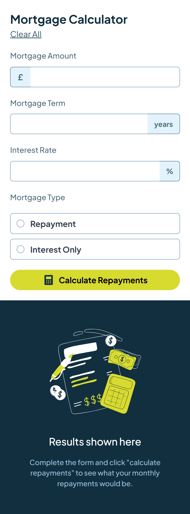
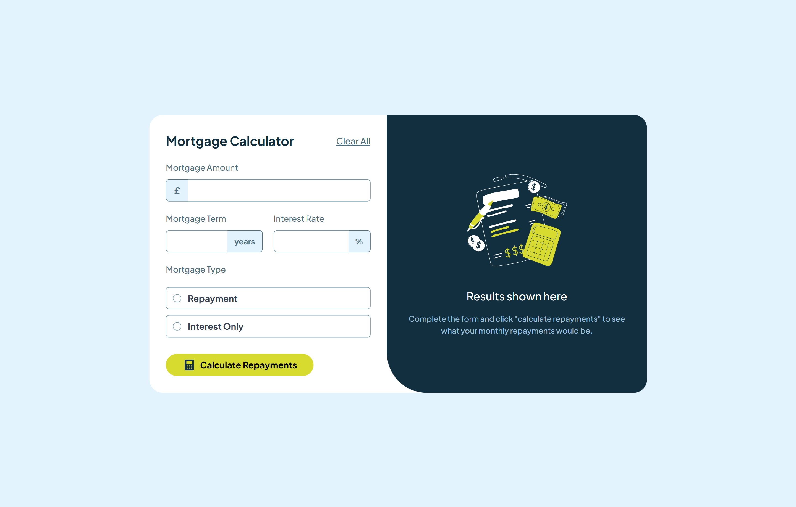

# Frontend Mentor - Mortgage repayment calculator solution

This is a solution to the [Mortgage repayment calculator challenge on Frontend Mentor](https://www.frontendmentor.io/challenges/mortgage-repayment-calculator-Galx1LXK73). Frontend Mentor challenges help you improve your coding skills by building realistic projects. 

## Table of contents

- [Overview](#overview)
  - [The challenge](#the-challenge)
  - [Screenshot](#screenshot)
  - [Links](#links)
- [My process](#my-process)
  - [Built with](#built-with)
  - [What I learned](#what-i-learned)
  - [Useful resources](#useful-resources)
- [Author](#author)


## Overview

### The challenge

Users should be able to:

- Input mortgage information and see monthly repayment and total repayment amounts after submitting the form
- See form validation messages if any field is incomplete
- Complete the form only using their keyboard
- View the optimal layout for the interface depending on their device's screen size
- See hover and focus states for all interactive elements on the page

### Screenshot





### Links

- Solution URL: [GitHub Repo](https://github.com/lianxxxx/mortgage-calculator)
- Live Site URL: [Netlify](https://mortgage-calc-frontend-mentor.netlify.app/)

## My process

### Built with

- Semantic HTML5 markup
- CSS custom properties
- Flexbox
- Mobile-first workflow
- [React](https://reactjs.org/) - JS library
- [Vite](https://vite.dev/) - Frontend build tool
- [Tailwind](https://tailwindcss.com/) - CSS framework


### What I learned

### What I learned

This project taught me several valuable lessons about building production-ready React applications:

**1. The Critical Importance of Input Validation**

I learned that validation isn't just about checking if fields are filled—it's about providing clear, immediate feedback to users. Implementing error states that clear automatically as users type creates a much better UX than simple alerts.
```js
const handleCalculate = () => {
  const newErrors = {
    amount: !amount || amount === '0',
    term: !term || term === '0',
    rate: !rate || rate === '0',
    type: !type
  };
  
  setErrors(newErrors);
  
  if (Object.values(newErrors).some(error => error)) {
    return; // Stop execution and show error messages
  }
  
  const result = computeMortgage(amount, term, rate, type);
  if (result) setResult(result);
};
```

**2. Separation of Concerns: Logic vs. Presentation**

One of my biggest takeaways was understanding the importance of separating business logic from UI components. By creating a dedicated `utils` folder for the mortgage calculations, I made the code:
- Easier to test
- More reusable
- Simpler to debug
- Cleaner to read
```js
// utils/mortgageLogic.js - Pure calculation logic
export function computeMortgage(amount, term, interest, type) {
  const monthlyRate = interest / 12 / 100;
  const totalPayments = term * 12;
  
  if (type === "repayment") {
    const factor = Math.pow(1 + monthlyRate, totalPayments);
    monthlyPayment = amount * (monthlyRate * factor) / (factor - 1);
    // ...
  }
  // Component just calls this function, doesn't need to know the math
}
```

**3. Custom Radio Buttons and Active States**

This took me over 2 days to get right! Managing custom-styled radio buttons with multiple states (default, focused, active, and error) taught me a lot about CSS specificity and conditional className management in React.
```css
/* Managing multiple states was tricky */
.amount-term-rate.active {
  background-color: var(--lime);
  border-color: var(--lime);
}

.amount-term-rate.bg-red-500 {
  background-color: #ef4444 !important;
  border-color: #ef4444 !important;
}

/* Error state overriding focus state */
#mortgage-amount.border-red-500:focus {
  border-color: #ef4444 !important;
}
```
```jsx
// Dynamic className based on multiple conditions
className={`absolute left-0 top-0 h-full w-10 flex items-center justify-center font-semibold rounded-l-md border border-r-0 amount-term-rate ${
  errors.amount ? "bg-red-500 text-white border-red-500" : 
  isAmountFocused ? "active" : ""
}`}
```

**4. Number Formatting While Maintaining Data Integrity**

Displaying formatted numbers (300,000) while storing raw values (300000) for calculations was a great lesson in controlled components:
```js
const formatNumberWithCommas = (value) => {
  if (!value) return '';
  const cleanValue = value.toString().replace(/^0+/, '') || '0';
  return cleanValue.replace(/\B(?=(\d{3})+(?!\d))/g, ',');
};

// Display formatted, store raw
<input
  value={formatNumberWithCommas(amount)}  // Shows: "300,000"
  onChange={handleAmountChange}           // Stores: "300000"
/>
```

These challenges really reinforced that good UX requires attention to detail in both logic and presentation!


### Useful resources

- [Claude AI (Anthropic)](https://claude.ai) - Claude helped me for implementing the mortgage calculator logic and debugging. Particularly helpful for:
  - Understanding the difference between repayment and interest-only mortgage formulas
  - Implementing input validation with error states and conditional styling
  - Debugging number formatting issues (commas in inputs and outputs)
  - Planning component structure and state management

- [ChatGPT (OpenAI)](https://chat.openai.com) - Assisted with initial project setup, folder structure organization, and answering general React questions that helped me get started.

## Author

- Frontend Mentor - [@lianxxxx](https://www.frontendmentor.io/profile/lianxxxx)
- GitHub - [@lianxxxx](https://github.com/lianxxxx)


